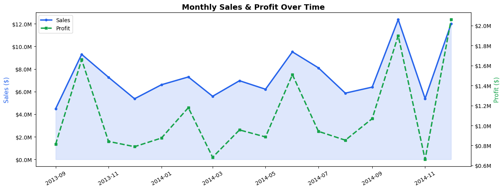

# -financial-data-cleaning-eda
 Data cleaning and EDA on kaggle Financials dataset using Python
# 📊 Financial Data — Cleaning & Exploratory Data Analysis


---

## 📌 Overview

End-to-end **data cleaning and exploratory data analysis** on a Financials dataset from kaggle.

The raw data contained multiple real-world data quality issues — hidden whitespace in column names, financial figures stored as strings with `$` signs and thousands commas, and dates stored as plain text. This project tackles all of them systematically before extracting business insights through visualisation.

---

## 📁 Repository Structure

```
financial-data-cleaning-eda/
│
├── Financials_EDA.ipynb        ← Main notebook (cleaning + EDA + charts)
├── Financials.csv              ← Raw dataset
├── sales_profit_timeline.png   ← Monthly Sales & Profit chart
└── README.md                   ← You are here
```

---

## 🗃️ Dataset

| Property       | Detail                                                              |
| -------------- | ------------------------------------------------------------------- |
| **Rows**       | 700                                                                 |
| **Columns**    | 16                                                                  |
| **Segments**   | Government, Midmarket, Enterprise, Small Business, Channel Partners |
| **Countries**  | Canada, Germany, France, Mexico, United States of America           |
| **Products**   | Carretera, Montana, Paseo, Velo, VTT, Amarilla                      |
| **Date Range** | September 2013 — December 2014                                      |

---

## 🧹 Data Cleaning

### Problems Found in Raw Data

| Issue                             | Detail                                                        |
| --------------------------------- | ------------------------------------------------------------- |
| Hidden whitespace in column names | 12 out of 16 columns had leading/trailing spaces              |
| Double leading space              | `'  Sales '` — the sneakiest bug                              |
| Dollar signs                      | All 8 financial columns prefixed with `$`                     |
| Thousands commas                  | e.g. `$1,36,170.00` (Indian number formatting)                |
| Bare dashes                       | `-` used to represent zero values                             |
| Wrong dtypes                      | All financial columns stored as `object` instead of `float64` |
| Date as string                    | `date` column stored as plain text, not `datetime`            |

### Solutions Applied

```python
# 1. Audit column names with repr() to expose hidden characters
for col in df.columns:
    print(repr(col))

# 2. Strip whitespace + convert to snake_case
df.columns = df.columns.str.strip()
df.columns = df.columns.str.lower().str.replace(' ', '_')

# 3. Clean numeric columns — remove $, commas and dashes
def clean_numeric(series):
    s = series.astype(str).str.strip()
    s = s.str.replace('$', '', regex=False)
    s = s.str.replace(',', '', regex=False)
    s = s.replace('-', '0')
    return pd.to_numeric(s, errors='coerce')

# 4. Parse dates correctly (DD/MM/YYYY format)
df['date'] = pd.to_datetime(df['date'], dayfirst=True)
```

---

## 🔍 Exploratory Data Analysis

### Missing Values

- Only `profit` had missing values — **58 nulls (8.3%)** out of 700 rows
- All other 16 columns were complete

### Descriptive Statistics (Key Columns)

| Metric     | Units Sold | Sales      | Profit   |
| ---------- | ---------- | ---------- | -------- |
| **Mean**   | 1,608      | $169,609   | $27,525  |
| **Median** | 1,543      | $35,540    | $10,890  |
| **Max**    | 4,493      | $1,159,200 | $262,200 |

> **Note:** The large gap between mean and median in Sales and Profit indicates right-skewed distributions — a small number of very large transactions pull the average up significantly.

---

## 📊 Visualisations

### 1. Monthly Sales & Profit Over Time

Dual-axis timeline revealing seasonality, trends and anomalies across 16 months.



### 2. Sales & Profit by Segment

Horizontal bar chart comparing revenue and profit overlay across all 5 customer segments.

### 3. Total Profit by Product

Bar chart with green/red colour coding showing profit performance per product.

### 4. Profit Margin % by Country

Reveals which markets are truly efficient, not just high volume.

### 5. Average Profit by Discount Band

Shows the business impact of discounting across None → Low → Medium → High bands.

---

## 🔑 Key Business Insights

1. **Government dominates** — $52.5M in sales, nearly 3x second place Small Business ($42.4M)
2. **Paseo is the star product** — highest cumulative profit at $4.9M across all 6 products
3. **Channel Partners & Midmarket are negligible** — combined under $4M total sales
4. **Discounts consistently erode profit** — clear downward trend from None → High discount band
5. **Q4 seasonal spikes** — visible in both 2013 and 2014, likely driven by government year-end budget cycles
6. **November 2014 anomaly** — sales peaked at ~$12M but profit crashed to ~$0.6M, suggesting extreme discounting or an unexpected cost spike worth investigating
7. **Thin overall margins (~14.9%)** — cost control and discount strategy are critical levers for this business

---

## 💡 Key Learnings

> _Most data errors are silent. They don't crash your code — they just give you wrong answers quietly._
>
> Always run `repr()`, `.dtypes`, and `.describe()` before touching anything.

---

## 🛠️ Tools & Libraries

| Library             | Purpose                              |
| ------------------- | ------------------------------------ |
| `pandas`            | Data loading, cleaning, manipulation |
| `matplotlib`        | All visualisations                   |
| `matplotlib.ticker` | Axis label formatting ($M, $K)       |

---

## 🚀 How to Run

```bash
# Clone the repo
git clone https://github.com/YourUsername/financial-data-cleaning-eda.git

# Install dependencies
pip install pandas matplotlib jupyter

# Launch notebook
jupyter notebook Financials_EDA.ipynb
```

---

## 👤 Author

**Bukunmi Damilola Olokede**  
Data Analyst | Python | SQL | Power BI

[
[![GitHub] bukunmidamilolaolokede (https://github.com/bukunmidamilolaolokede)

---

_Dataset: Financials Dataset | For portfolio and learning purposes_
